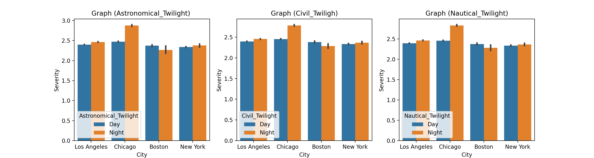
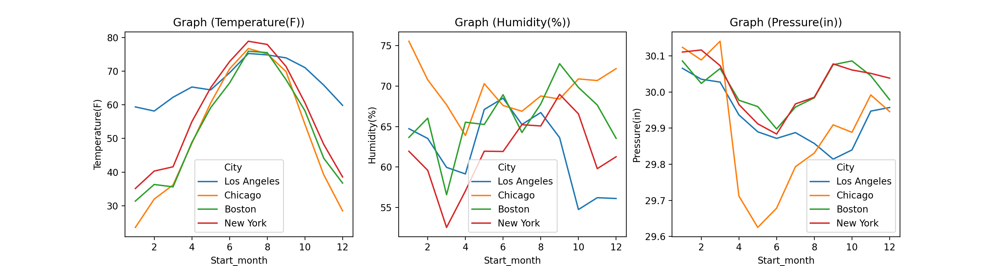

## Vehicle Collisions ##

### Initial Dataset ###

**General Information on the data we'll be using**</br>
- This data will provide insight into vehicle collisions for the four biggest cities in the U.S from 2016 to 2019.</br></br>
- The goal is to explore the data and gain some insights to have a better understanding.</br></br>
  - **Severity:** Displays a numeric value from 1 to 4 with 1 being the least severe and 4 being the most severe.
  - **Start_Time:** Shows the start time of the accident in the corresponding timezone.
  - **End_Time:**  Shows the end time of the accident in the corresponding timezone.
  - **Side:** Shows the relative side in the address field.
  - **City:** Shows the city relative to collision.
  - **Termperature(F):** Displays the temperature in Farenheiht.
  - **Humidity(%):** Shows the humidity as a percentage.
  - **Pressure(in):** Shows air pressure in inches.
  - **Civil_Twilight:**  Civil twilight is defined as the time when the Sun is just below the horizon, so there is generally enough natural light to carry out most outdoor activities.
  - **Nautical_Twilight:** Defined as the time when the horizon and the brighter stars are usually visible at this time, making it possible to navigate at sea.
  - **Astronimical_Twilight:** Defined as the time when the geometric center of the Sun is at 18 degrees below the horizon. Before this time, the sky is absolutely dark.</br></br>
 - **What other insights can we gather from the selected tables?**</br></br>
   - We can extrapolate the time difference from subtracting the Start_Time and End_Time columns and determine who had the longest time to clear a collision.
   
   - The 'Side' column is categorical and will need to be represented as a number, so we can use them for our purposes.</br></br>
  ``` Python      
  df['Side'].replace('L',1, inplace=True)
  df['Side'].replace('R',0, inplace=True)
  ```   
**1. Looking at the amount of accidents per city by twilight (Night/Day).**






