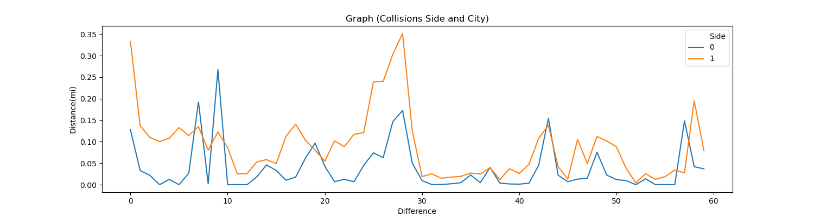
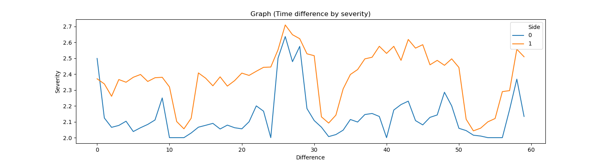
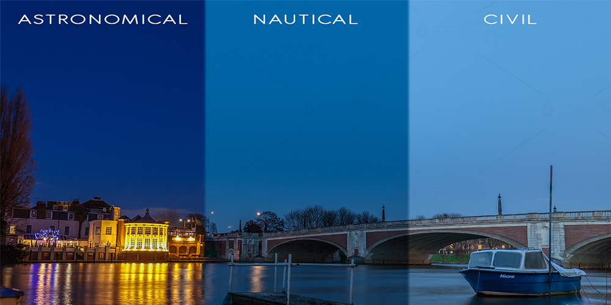

## Vehicle Collisions ##

### Initial Dataset ###

**General Information on the data we'll be using**</br>
- This data will provide insight into vehicle collisions for the four biggest cities in the U.S from 2016 to 2019.</br></br>
- The goal is to explore the data and gain some insights to have a better understanding.</br></br>
  - **Severity:** Displays a numeric value from 1 to 4 with 1 being the least severe and 4 being the most severe.
  - **Start_Time:** Shows the start time of the accident in the corresponding timezone.
  - **End_Time:**  Shows the end time of the accident in the corresponding timezone.
  - **Side:** Shows the relative side in the address field.
  - **City:** Shows the city relative to collision.
  - **Termperature(F):** Displays the temperature in Farenheiht.
  - **Humidity(%):** Shows the humidity as a percentage.
  - **Pressure(in):** Shows air pressure in inches.
  - **Civil_Twilight:**  Civil twilight is defined as the time when the Sun is just below the horizon, so there is generally enough natural light to carry out most outdoor activities.
  - **Nautical_Twilight:** Defined as the time when the horizon and the brighter stars are usually visible at this time, making it possible to navigate at sea.
  - **Astronimical_Twilight:** Defined as the time when the geometric center of the Sun is at 18 degrees below the horizon. Before this time, the sky is absolutely dark.</br></br>
 - **What other insights can we gather from the selected tables?**</br></br>
   - We can extrapolate the time difference from subtracting the Start_Time and End_Time columns and determine who had the longest time to clear a collision.</br></br>
  ``` Python
  df['Difference'] = (df['End_Date'] - df['Start_Date'])
  ```
   
   The 'Side' column is categorical and will need to be represented as a number, so we can use them for our purposes.</br>
  
  ```Python      
  df['Side'].replace('L',1, inplace=True)
  df['Side'].replace('R',0, inplace=True)
  ```   
  </br>
  
  - What we can determine from the information provided is more traffic collisions occur on the right side (slow lane) as opposed to the left side of the street (fast/lane) in either direction of direction of traffic. In rating response times, we can observe that Chicago has the fastest clear up time on either side and Los Angeles has the slowest overall. Also, we can determine that it takes longer for accidents to clear up on the right side than the left in general. Lets also look at the length of the road affected by the accidents and if there was a difference in how long it took to clear up.</br>
  
   </br>
 - The story told from the data is that typically the longer the length the accidents affect on traffic is, the longer it takes to clear up, and finally lets look at how long collision take to clear up by the severity of the collision. </br>
 
  </br>
  - From this we can see that indeed the worse the collision the longer it takes to clear. We can also see that the left side does have more collisions as compared to the right.

**1. Looking at the time difference of accidents per city and twilight (Night/Day).**
- Below is a visual representation of twilight for context.</br></br>
</br>


```Python
fig3, ax = plt.subplots(ncols=3,figsize=(15,4))
sns.barplot(x='City',y='Difference', data=df,ax=ax[0],hue='Astronomical_Twilight').set_title('Time_Diff (Astronomical_Twilight)')
sns.barplot(x='City',y='Difference', data=df, ax=ax[1],hue='Civil_Twilight').set_title("Time_Diff (Civil_Twilight)")
sns.barplot(x='City',y='Difference', data=df,ax=ax[2],hue='Nautical_Twilight').set_title("Time_Diff (Nautical_Twilight)")
```


</br>

**2. Looking at the amount of accident resolution per month, and temperature grouped by city.**
```Python
#Weather graph
fig2, axs = plt.subplots(ncols=3,figsize=(15,4))
sns.lineplot(x='Start_month', y='Temperature(F)', data=df, ax=axs[0],hue='City',ci=None).set_title("Graph (Temperature(F))")
sns.lineplot(x='Start_month', y='Humidity(%)', data=df, ax=axs[1],hue='City',ci=None).set_title("Graph (Humidity(%))")
sns.lineplot(x='Start_month', y='Pressure(in)', data=df, ax=axs[2],hue='City',ci=None).set_title("Graph (Pressure(in))")
```


</br>
**3. Looking at the time difference of accident resolution per temperature and grouped by city.**
```Python
fig2, axs = plt.subplots(ncols=3,figsize=(15,4))
sns.lineplot(x='Difference', y='Temperature(F)', data=df, ax=axs[0],hue='City',ci=None).set_title("Time_Diff (Temperature(F))")
sns.lineplot(x='Difference', y='Humidity(%)', data=df, ax=axs[1],hue='City',ci=None).set_title("Time_Diff (Humidity(%))")
sns.lineplot(x='Difference', y='Pressure(in)', data=df, ax=axs[2],hue='City',ci=None).set_title("Time_DIff (Pressure(in))")
```


